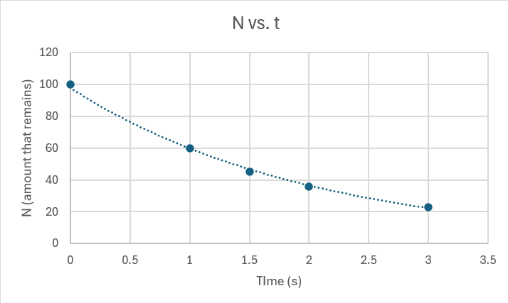
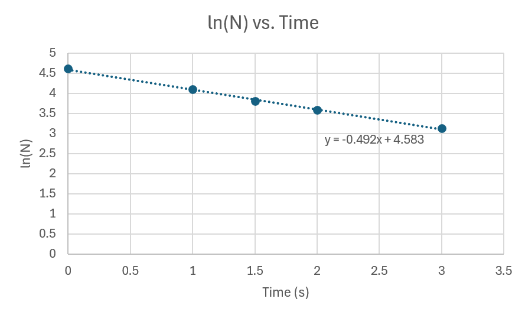

# Stellar Fusion

- More massive stars have more fusion because they need to undergo more fusion in order to balance the higher gravitational force.
- More massive stars live longer because they undergo fusion more slowly.
- VERY massive stars become supernovae because the force of gravity overcomes the force of fusion when fusion ends.

## Nuclear Stuff 

- Critical point and chain reaction
- How to arrive at criticality without an explosion

# Radioactive Decay (6/3/2024)

| Decay Type | Particle | Example | Description |
|------------|----------|---------|-------------|
| Alpha decay | Alpha (positively charged) particles | Po-210 to Pb-206 | Releases energy. Can't go through things, doesn't hurt you because it's just helium. |
| Beta decay | High energy and speed E- (electron) or e+ (positron) | Se-79 to Br-79- | Proton -> neutron + positron + electron neutrino OR neutron -> proton + electron + electron antineutrino. Weak nuclear force allows up quark to change into a down quark, or vice versa. Will penetrate skin. |
| Gamma decay | High energy and speed gamma **rays** | Co-60 to Co-60* | Co-60* is an excited state of Co-60. Co-60* releases energy in the form of gamma rays. Will penetrate skin. |

## Measuring Radiation (6/4/2024)

### Background Radiation

- Background radiation is everywhere. It's not harmful because it's not concentrated. Examples:
  - Cosmic rays
  - Bananas
  - Watches with radium paint
  
### Measurements
- N: how much remains
- A: activity, how much is emitted
  - λN=-dN/dt
  - Exponential relationship between N and t
  - FORMULA: N=N0e-λt
    - t1/2=ln(2)/λ
    - Linearize by taking ln of both side

### Simulation

| Time (s) | N (amount that remains) |
|----------|---------------------|
| 0        | 100                 |
| 1        | 60                 |
| 1.5        | 45                  |
| 2        | 36                  |
| 3        | 23                  |

We then linearize N to get useful data from it:

We can now calculate for the half-life of the substance:

t1/2=0.693/λ

t1/2=0.693/0.492 (we drop the negative because the equation already has negative)

t1/2=1.41 s

# HL 2 Stuff (6/5/2024)

## Rutherford Scattering

- High-energy alpha particles get closer to the nucleus (more force). Rutherford scattering demonstrates that the strong nuclear force impacts high-energy alpha particles to a greater extent than the electromagnetic force.
  - Electromagnetic force: less force
  - Strong nuclear force: more force
- **The energy dropoff allows us to measure the radius of the atom.**
- Electrons thrown at a plum pudding atom model should **not** get deflected, but it has been experimentally determined that they do (electrons present around the nucleus don't affect it to a great extent because -1 vc +60). Rutherford scattering is what really happens. 
- Most alpha particles pass through, but some are scattered.

## Bohr Models

- Alpha particles are bouncing off of the positively charged nucleus
  - Electromagnetic force causes the deflection
- **Electrons are attracted to the nucleus by exchanging photons**

### Standard Model of Particle Physics

- Up quark + down quark + electrons (type of lepton) make up an atom
- Neutrinos have a small mass and don't interact with anything but the weak nuclear force, which makes them hard to detect
- Gluons carry the strong nuclear force
- Antineutrino is oppositely charged to neutrino
- **Wave function:** Everything can be described as a wave function, which is a probability amplitude distribution of where a particle is likely to be found
  - What actually is our particle at different points in times and where is it?
- Heisenberg Uncertainty Principle: You can't know both the position and momentum of a particle at the same time
- Energy and Time: The more you know about when your particle is, the less you know about its energy, and vice versa
- KEY IDEAS:
  - Rutherford experiment tells us that the atom is mostly empty space
  - Rutherford scattering shows that electromagnetic force is not the only relevant force (strong nuclear as you approach larger and larger forces). 
    - Can also be used to measure the radius
  - Standard model: there are particles that have mass. Higgs Boson gives mass to particles.
  - Antimatter exists. Pair annhilation occurs when anti and normal particles collide and turn into lots of energy
